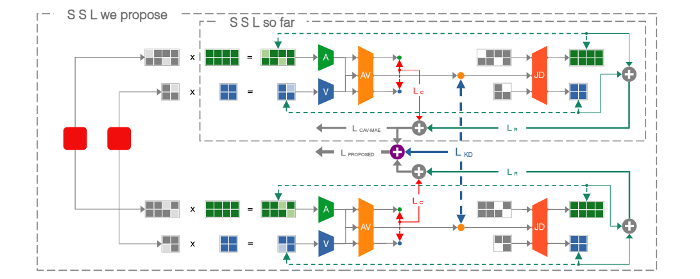

# KDC-MAE

This repository contains the official implementation of **KDC-MAE** (Knowledge Distilled Contrastive Mask Auto-Encoder) proposed in WACV 2025. KDC-MAE is a novel Self-Supervised Learning (SSL) method that combines contrastive learning, knowledge distillation, and masked data modeling to learn joint and modular audio-video representations. It improves learning across multiple modalities and tasks.

---

## Table of Contents
1. [Overview](#overview)
2. [Features](#features)
3. [Installation](#installation)
4. [Usage](#usage)
   - [Data Preparation](#data-preparation)
   - [Training](#training)
   - [Evaluation](#evaluation)
5. [Results](#results)
6. [Requirements](#requirements)
7. [License](#license)
8. [Acknowledgments](#acknowledgments)

---

## Overview
KDC-MAE introduces a cutting-edge SSL framework that combines the strengths of contrastive learning, self-distillation, and masked data modeling to achieve superior performance across audio, video, and multimodal tasks. 

### Paper Link
The preprint of our paper is available on [arXiv](https://arxiv.org/abs/2411.12270).

### Architecture Diagram


### Key Contributions:
1. **Complementary Masking Strategy**: Ensures better modular correspondence between audio and video modalities.
2. **Knowledge Distillation**: Enhances latent embedding alignment with Kullback-Leibler divergence loss.
3. **Unified Learning Objective**: Integrates reconstruction, contrastive loss, and self-distillation losses for robust multimodal representation learning.

KDC-MAE is particularly designed for tasks like **classification, retrieval, inpainting**, and **visual sound source localization** on multimodal datasets such as AudioSet and VGGSound.

---

## Features
- **Complementary Masking**: Non-overlapping masks to improve joint and modular learning.
- **Self-Distillation**: KL-divergence applied to parallel masked encoder outputs.
- **Unified Multimodal Learning**: Integrates masked data modeling, contrastive learning, and knowledge distillation.
- **State-of-the-Art Results**: Achieves better performance on tasks like retrieval, classification, and inpainting.

---

## Installation
```bash
# Clone the repository
git clone https://github.com/yourusername/kdc-mae.git
cd kdc-mae

# Install dependencies
pip install -r requirements.txt
```

---

## Usage
### Data Preparation
To Prepare the datasets (e.g., AudioSet, VGGSound, Kinetics-400), follow this [guide](https://github.com/yuangongnd/cav-mae?tab=readme-ov-file#data-preparation)


### Training
Train the model with the desired configuration:
Check out `egs/` for the training scripts of pretraining and finetuning

### Evaluation
Check out src/retrieval.py and src/inpaint.py for respective evaluations. For classification evaluation use the finetune scripts in `egs/`.

---

## Results
KDC-MAE achieves state-of-the-art performance across multiple benchmarks:

### Classification Accuracy
| Dataset      | Method                | Audio Only | Video Only | Audio-Video |
|--------------|-----------------------|------------|------------|-------------|
| VGG-Sound    | CAV-MAE               | 58.6%      | 43.2%      | 63.89%      |
|              | Proposed (KDC-MAE)    | 58.73%     | 43.43%     | 64.23%      |
| AudioSet-20K | CAV-MAE               | 37.95%     | 31.0%      | 39.61%      |
|              | Proposed (KDC-MAE)    | 37.62%     | 30.95%     | 41.03%      |

### Additional Tasks:
- **Retrieval**: Improved audio-to-visual and visual-to-audio retrieval accuracy.
- **Inpainting**: Lower reconstruction loss.
- **Localization**: Competitive results in visual sound source localization.

---

---

## Requirements
- Python >= 3.8
Install them using:
```bash
pip install -r requirements.txt
```
---

## License
This project is licensed under the MIT License - see the [LICENSE](LICENSE) file for details.

---

## Acknowledgments
- **Dataset Sources**: AudioSet, VGGSound, and Kinetics-400.
- **Research Work**: This project is part of the research accepted at **WACV 2025**.
- Special thanks to the authors and contributors of previous frameworks like CAV-MAE and related SSL methodologies.
